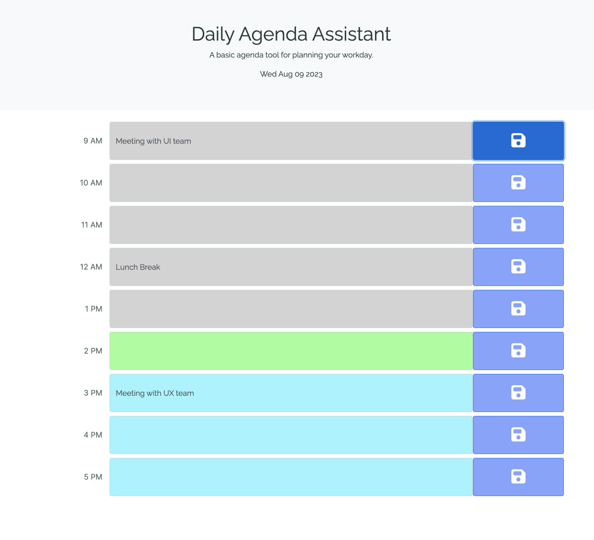

# daily-planner-app

## Description
This repo contains the Module 05 Challenge. This repository contains a browser-based calendar application a digital tool designed to streamline and enhance your daily planning process. With a clear and intuitive interface, users can quickly outline tasks and appointments.

## Instalation
N/A

## Usage
You can visit the live website by clicking on the following link:
 https://carlos-2mm.github.io/daily-agenda-assistant/

A preview of the website:

## Credits

https://fonts.googleapis.com/css2?family=Inter&family=Raleway&display=swap"
 Serves as the resource for the Inter font.

https://fonts.googleapis.com/css2?family=Inter&family=Raleway&display=swap"
 Serves as the resource for the Raleway font.

https://getbootstrap.com/docs/4.5/getting-started/introduction/
 Resource for understanding Bootstrap's project structure and design components. Also reference for grid system

https://getbootstrap.com/docs/4.5/components/buttons/
 Resource for understanding Bootstrap's button components Reference for styling and behavior of buttons in the project.

https://api.jquery.com/on/
 Resource for understanding jQuery's `.on()` event handler. Provided by jQuery. Reference for adding event listeners to elements.

https://fontawesome.com/icons/floppy-disk?style=solid
 Resource for sourcing the floppy disk icon used in the application. Provided by FontAwesome. Reference for icon classes and integration.

https://developer.mozilla.org/en-US/docs/Web/JavaScript/Reference/Global_Objects/Date/getHours
 Resource for understanding JavaScript's `Date.getHours()` method. Provided by MDN Web Docs. Reference for time-based functionalities in the project.

## License

Please refer to the LICENSE in repo
